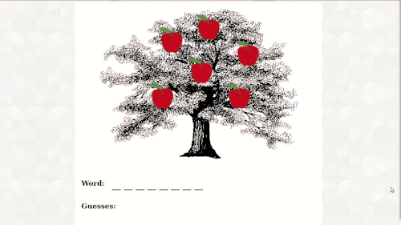

# Guess-A-Word #

Guess-A-Word is very functionally similar to hangman, with a nicer theme. This
was built with ES6 and jQuery.

## Example Usage ##

  

## Installation ##

1. Clone this repository (`git clone https://github.com/johnisom/guess-a-word`)
2. `cd` into the repository (`cd guess-a-word`)
3. Open `index.html` in your favorite web browser
4. Enjoy guessing words
